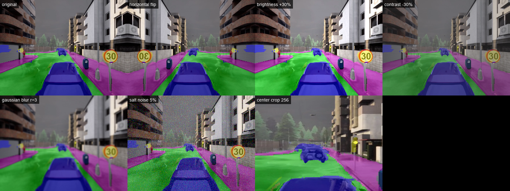
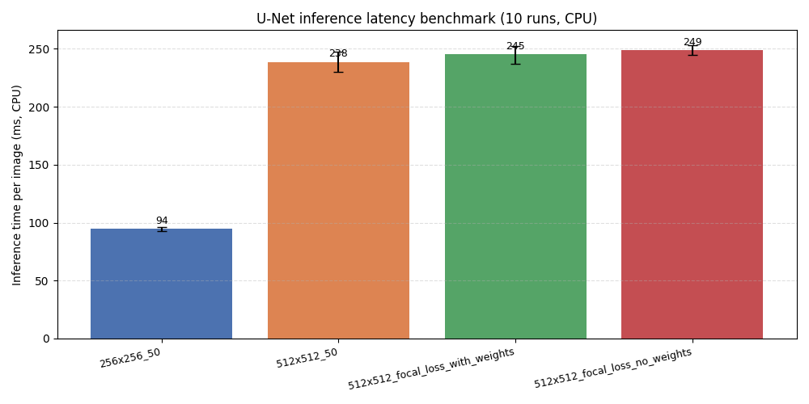
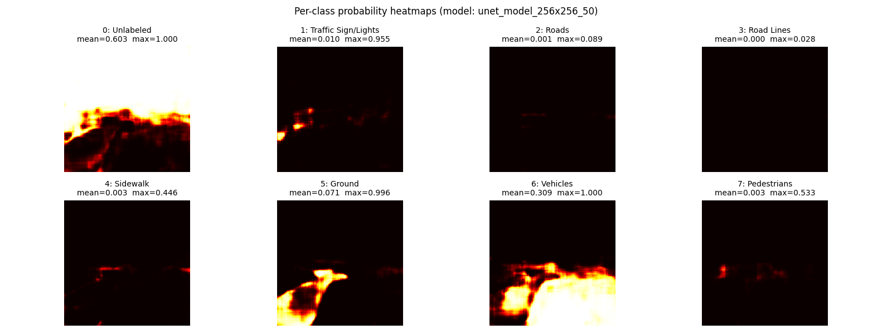

# 自动驾驶车辆语义分割

基于 **U-Net** 与 **CARLA 自动驾驶仿真平台** 的逐像素语义分割模块。源自伍斯特理工学院（WPI）研究生课程 **RBE549 计算机视觉**，团队选定"自动驾驶场景下的语义分割"作为期末研究：通过自动化脚本在 CARLA 仿真器中批量采集数千张带标注街景图像构建数据集，使用 **Focal Loss + 类别权重** 训练 U-Net 模型以缓解 CARLA 训练集中约 **817:1** 的极端类别不平衡，并对比不同输入尺寸/损失函数下的表现。

模块代码位于仓库的 [`src/auto_drive_seg/`](https://github.com/OpenHUTB/nn/tree/main/src/auto_drive_seg)。

## 目录

- [项目简介](#introduction)
- [安装步骤](#installation)
- [快速开始](#quick-start)
- [运行效果](#results)
- [核心技术](#core-tech)
- [类别定义与配色](#categories)
- [项目结构](#structure)
- [参考资料](#references)

## 项目简介 <a name="introduction"></a>

自动驾驶车辆需要从摄像头视频中实时理解周围环境：道路位置、人行道边界、前方车辆与行人——这些都是规划与控制的前置信息。**语义分割（Semantic Segmentation）** 把图像逐像素分到一个语义类别，是这一感知任务的标准解法。

本项目以 **CARLA** 作为数据源（自带"语义分割相机"传感器，省掉手工标注开销），实现了完整的"采集 → 训练 → 推理 → 评估"流水线。模块入口 `main.py` 提供六种使用模式，按扩展名/参数自动识别：

- **图片分割**：单张图片 → 叠加图 + 纯掩码
- **视频分割**：视频文件 → 逐帧分割叠加视频 + 采样帧拼图
- **数据增强可视化**（`--augment`）：展示训练时使用的 6 种数据增强
- **推理延迟基准测试**（`--benchmark`）：4 个预训练模型的 CPU 推理速度对比
- **类别概率热力图**（`--heatmap`）：8 类 softmax 输出可视化，诊断模型偏置
- **类别频率分析**（`--frequency`）：量化展示 CARLA 训练集类别不平衡与 Focal Loss 权重

## 安装步骤 <a name="installation"></a>

### 环境要求

- 平台：Windows 10/11 或 Linux
- Python 3.10（TensorFlow 2.10 要求 Python 3.7–3.10）
- 纯 CPU 即可运行推理，无需 GPU

### 安装流程

1. 克隆仓库：

```sh
git clone https://github.com/OpenHUTB/nn.git
cd nn/src/auto_drive_seg
```

2. 创建 conda 环境并安装依赖：

```sh
conda create -n py310 python=3.10 -y
conda activate py310
pip install -r requirements.txt
```

国内网络可加清华镜像：`pip install -r requirements.txt -i https://pypi.tuna.tsinghua.edu.cn/simple`

3. 获取预训练模型（模型为二进制大文件，未随仓库提交）：

```sh
git clone https://github.com/hlfshell/rbe549-project-segmentation
```

将 `rbe549-project-segmentation/models/unet_model_256x256_50` 整个目录复制到本模块的 `models/` 目录。原仓 `models/` 下另有 `unet_model_512x512_50`、`unet_model_512x512_focal_loss_with_weights` 等更大输入尺寸的模型，可按需替换或全部下载用于多模型对比。

## 快速开始 <a name="quick-start"></a>

`main.py` 是模块统一入口，按参数自动派发到不同模式。

### 图片输入

```sh
cd src/auto_drive_seg
python main.py                                # 默认示例图 + 默认 256x256 模型
python main.py examples/sample_input.png      # 指定输入图
python main.py examples/sample_input.png models/unet_model_512x512_50
```

运行后在输入图同目录生成 `*_overlay.png`（分割叠加图）和 `*_mask.png`（纯掩码图）。

### 视频输入

```sh
python main.py path/to/video.mp4              # 自动识别 .mp4/.avi/.mov/.mkv/.webm
python main.py path/to/video.mp4 models/unet_model_256x256_50 120  # 限制 120 帧
```

输出 `*_seg.mp4`（逐帧分割叠加视频）和 `*_seg_frames.png`（采样帧拼图）。

### 数据增强可视化

```sh
python main.py --augment                      # 默认示例图
python main.py --augment examples/sample_input.png
```

输出 4 列拼图：原图 + 6 种增强（水平翻转、亮度+30%、对比度-30%、高斯模糊、椒盐噪声、中心裁剪）。

### 推理延迟基准测试

```sh
python main.py --benchmark                    # 自动加载 models/ 下所有预训练模型
```

每个模型 2 次预热 + 10 次正式推理，输出柱状图（含 mean ± min/max 误差棒）+ 控制台 markdown 表格。

### 类别概率热力图

```sh
python main.py --heatmap                                      # 默认 256x256 模型
python main.py --heatmap examples/sample_input.png models/unet_model_512x512_50
```

输出 4×2 网格：8 类的 softmax 概率灰度热力图，每张面板标该类的均值/最大值。

### 类别频率分析

```sh
python main.py --frequency                    # 不需要模型或输入图
```

控制台输出 markdown 表格 + 极端比例（约 817:1），同时生成两栏柱状图（左：log 纵轴像素占比；右：训练实际使用的 Focal Loss 权重）。

## 运行效果 <a name="results"></a>

### 单张图片：分割叠加 + 纯掩码

输入 CARLA 街景图，模型输出每像素类别预测，叠加在原图上（蓝=车辆、绿=道路/地面、红=行人、黄=交通标志）：

<p align="center">

</p>

仅显示分割结果（纯掩码）：

<p align="center">

</p>

### 视频逐帧分割

视频中 6 个均匀采样帧的分割结果（叠加视频本身约 4MB，不入仓）：

<p align="center">

</p>

### 数据增强可视化

dataset.py 训练时随机施加 6 种增强缓解过拟合，下图为它们独立施加在同一张图上的效果：

<p align="center">

</p>

### 多模型 CPU 推理延迟

256x256 输入比 512x512 在 CPU 上快约 **2.6 倍**；512x512 的三个变体（基础、focal+权重、focal 无权重）速度几乎一致——计算量相同，差异仅在训练目标：

<p align="center">

</p>

### 类别概率热力图（模型偏置诊断）

亮 = 模型认为该位置更可能属于该类。256x256 模型对 Vehicles/Ground 高度自信（max≈1.0），但对 Roads（max≈0.09）和 Road Lines（max≈0.03）几乎检测不到，Pedestrians 最高置信度仅约 0.5——直接体现了类别不平衡对少数类的伤害：

<p align="center">

</p>

### 类别不平衡与 Focal Loss 权重

CARLA 训练集 8 类极度不平衡（最多 Unlabeled 占 54%，最少 Pedestrians 仅 0.066%，比例 **817:1**）。Focal Loss 用 `2·sigmoid(像素比例)` 把此跨度压成 1.12-2.00 的温和加权（少数类 ≈2.0、多数类 ≈1.1），让模型在每张图的梯度中也能感知少数类：

<p align="center">

</p>

## 核心技术 <a name="core-tech"></a>

### 网络结构：U-Net

经典 **U-Net** 编码-解码结构（[`src/auto_drive_seg/semantic/unet/model.py`](https://github.com/OpenHUTB/nn/blob/main/src/auto_drive_seg/semantic/unet/model.py)）：

- **下采样路径**：3 个残差块，特征通道 64 → 128 → 256，每块 SeparableConv2D + BatchNorm + ReLU + MaxPool 缩小特征图
- **上采样路径**：对应 4 个上采样块，Conv2DTranspose + UpSampling 还原空间分辨率，残差连接保留细节
- **输出层**：1×1 卷积 + softmax，逐像素输出 8 类概率

### 损失函数：Sparse Categorical Focal Loss + 类别权重

为解决类别不平衡，采用 **Focal Loss** 替代普通交叉熵：

\[
\mathrm{FL}(p_t) = -\alpha_t (1 - p_t)^\gamma \log(p_t)
\]

其中 \((1 - p_t)^\gamma\) 项压低"容易分对"样本（多数类的道路像素）的权重，让模型聚焦"难分对"样本（少数类的行人、交通标志）。本项目设 \(\gamma=2.0\)，并额外为每个类别赋予基于像素频率倒数的权重（用 `2·sigmoid` 压缩到 0-2 区间），详见 [`semantic/unet/train.py`](https://github.com/OpenHUTB/nn/blob/main/src/auto_drive_seg/semantic/unet/train.py) 中的 `CLASS_PIXEL_RATIOS`。

### 数据增强

训练时对每张图随机施加 6 种增强（[`semantic/unet/dataset.py`](https://github.com/OpenHUTB/nn/blob/main/src/auto_drive_seg/semantic/unet/dataset.py)）：水平翻转、亮度 ±40%、对比度 -40%、高斯模糊半径 0–5、椒盐噪声 0–7%、以及"中心区域裁剪缩放"（针对小目标识别）。可用 `python main.py --augment` 单独可视化每种增强的效果。

## 类别定义与配色 <a name="categories"></a>

本项目将 CARLA 默认的 23 类语义标签归并为 8 类，便于自动驾驶决策使用：

| ID | 类别 | 颜色 (R, G, B) | 估计像素占比 | Focal Loss 权重 |
|----|----|------|------|------|
| 0 | 未标注 (Unlabeled) | (0, 0, 0) | 53.998% | 1.115 |
| 1 | 交通标志/灯 (Traffic Sign/Lights) | (220, 220, 0) | 0.195% | 2.000 |
| 2 | 道路 (Roads) | (0, 255, 0) | 28.810% | 1.214 |
| 3 | 车道线 (Road Lines) | (157, 234, 50) | 1.284% | 2.000 |
| 4 | 人行道 (Sidewalk) | (244, 35, 232) | 5.162% | 1.837 |
| 5 | 地面 (Ground) | (107, 142, 35) | 4.393% | 1.890 |
| 6 | 车辆 (Vehicles) | (0, 0, 255) | 6.091% | 1.772 |
| 7 | 行人 (Pedestrians) | (220, 20, 60) | 0.066% | 2.000 |

完整 CARLA → 本项目类别映射见 [`semantic/carla_controller/labels.py`](https://github.com/OpenHUTB/nn/blob/main/src/auto_drive_seg/semantic/carla_controller/labels.py)。

## 项目结构 <a name="structure"></a>

```
src/auto_drive_seg/
    main.py                 推理入口（按 OpenHUTB 规范以 main. 开头，统一派发 6 种模式）
    requirements.txt        依赖清单
    semantic/               推理与训练核心代码
        unet/
            model.py            U-Net 编码-解码结构
            dataset.py          CARLA 数据生成器 + 数据增强
            train.py            训练循环 + Focal Loss + CLASS_PIXEL_RATIOS 常量
            utils.py            推理、可视化、掩码上色
        carla_controller/
            labels.py           CARLA → 8 类语义类别映射与配色
    examples/               示例输入图与运行效果图
    models/                 预训练模型（需自行获取，见安装步骤）
```

> 说明：原始项目中 `semantic/carla_controller/` 还含有 CARLA 数据采集脚本（依赖 `carla` 包与运行中的仿真器），与推理无关，本模块未收录。训练数据集需通过 CARLA 仿真器实跑采集，详见原始项目。

## 参考资料 <a name="references"></a>

- 原始项目：[hlfshell/rbe549-project-segmentation](https://github.com/hlfshell/rbe549-project-segmentation)
- U-Net 论文：Ronneberger O. et al., *U-Net: Convolutional Networks for Biomedical Image Segmentation*, MICCAI 2015
- Focal Loss 论文：Lin T. et al., *Focal Loss for Dense Object Detection*, ICCV 2017
- CARLA 模拟器：[https://carla.org/](https://carla.org/)
- CARLA 语义分割相机：[https://carla.readthedocs.io/en/latest/ref_sensors/#semantic-segmentation-camera](https://carla.readthedocs.io/en/latest/ref_sensors/#semantic-segmentation-camera)
