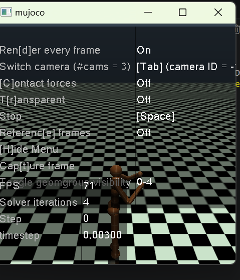
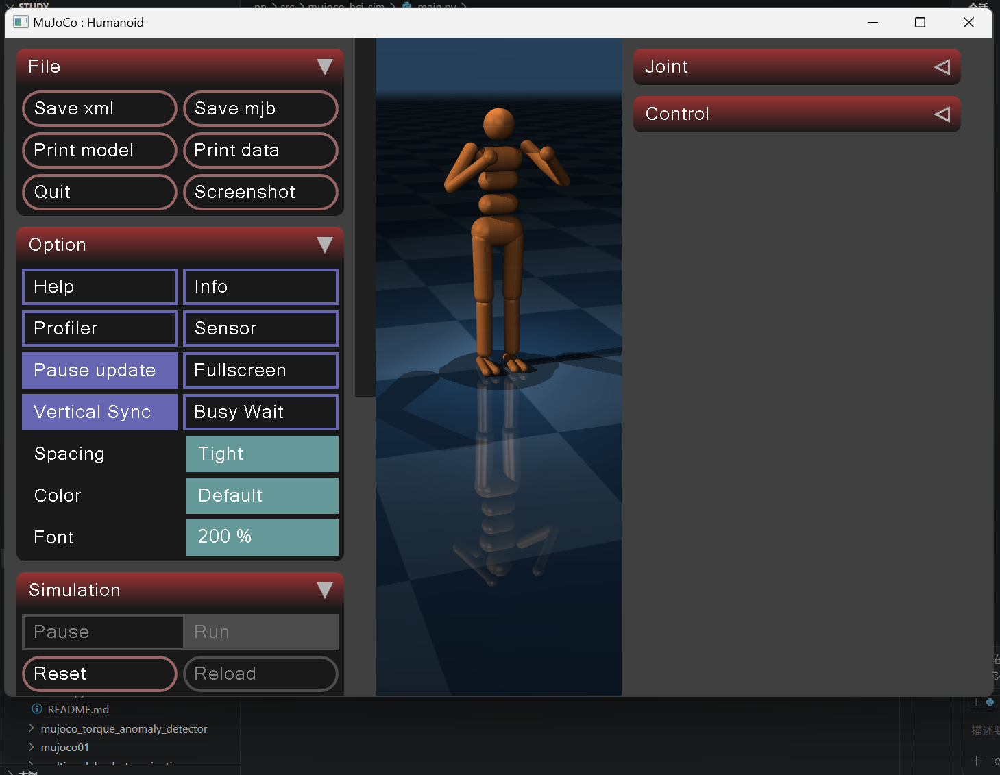

# 基于 PPO 强化学习的 Humanoid 人形机器人自主行走仿真

---

## 1. 项目概述

### 1.1 项目简介
本项目面向 **Humanoid-v4** 高自由度人形机器人在 MuJoCo 物理仿真中的自主平衡与行走控制需求，采用 **PPO（近端策略优化）强化学习算法**，结合多层环境包装、自定义奖励函数、观测历史堆叠、动作平滑与探索噪声、向量环境归一化等全套工程化方案，实现机器人**端到端自主学习稳定行走**，无需任何手工设计的控制律或步态参数。

项目基于 Stable-Baselines3 实现标准化强化学习训练流程，支持**断点续训、自动保存最优模型、训练可视化、实时仿真测试**，解决了高维连续动作空间、奖励稀疏、动作抖动、初始易摔倒等强化学习典型难点，最终形成**可直接运行、可快速复现、可轻松扩展**的人形机器人深度强化学习完整基线。

### 1.2 整体运行流程

系统标准强化学习闭环：
环境创建 → 观测预处理 → PPO 策略推理 → 动作执行 → 多维度奖励计算 → 策略梯度更新 → 模型 Checkpoint 保存 → 可视化评估测试

### 1.3 项目模块总览
| 模块 | 类/函数 | 功能 |
| ---- | ---- | ---- |
| 动作优化模块 | `ActionSmoothingWrapper` | 动作指数平滑，抑制动作抖动 |
| 探索增强模块 | `ActionNoiseWrapper` | 训练添加高斯噪声，提升策略探索能力 |
| 观测增强模块 | `ObsHistoryWrapper` | 堆叠多帧历史观测，补充时序运动信息 |
| 奖励设计模块 | `CustomRewardWrapper` | 多维度复合奖励，引导智能体学习有效策略 |
| 环境构建模块 | `make_env / make_train_env / make_test_env` | 训练/测试环境、向量环境、归一化管理 |
| 模型训练模块 | `train_model()` | PPO 初始化、加![alt text]载、训练、回调、模型保存 |
| 模型测试模块 | `test_model()` | 最优模型加载、可视化仿真、多轮效果评估 |

### 1.4 核心技术特点
| 特点 | 说明 |
| :--------- | :----------------------------------------------------------- |
| 算法成熟 | 使用工业级 PPO 算法，适配高维连续控制，训练稳定不易发散 |
| 观测增强 | 堆叠多帧历史观测，让策略感知运动速度与趋势，提升行走连贯性 |
| 动作优化 | 动作平滑滤波 + 高斯探索噪声，动作自然，避免陷入局部最优 |
| 奖励工程 | 前进奖励 + 姿态惩罚 + 能耗惩罚 + 平滑惩罚 + 接触惩罚 |
| 训练工程化 | 观测/奖励归一化、学习率线性衰减、自动保存最优模型、断点续训 |
| 完整流程 | 一键训练 → 自动评估 → 一键可视化测试，全流程自动化 |

### 1.5 项目核心目标
1. **自主行走**：双足人形机器人通过强化学习自主学会向前行走、保持身体平衡
2. **训练稳定**：800 万步内稳定收敛，训练过程不崩溃、不发散
3. **工程易用**：支持断点续训、环境统计参数持久化
4. **动作自然**：步态流畅、无剧烈抖动、抗轻微扰动
5. **高度扩展**：可修改奖励、网络结构、环境，适配更多机器人控制任务

---

## 2. 快速上手

### 2.1 运行环境要求
- 操作系统：Windows 11
- Python 版本：Python 3.10及以上
- 物理仿真：MuJoCo
- 强化学习框架：Stable-Baselines3

### 2.2 依赖安装
在项目根目录执行以下命令（清华镜像，加速下载）：
```bash
pip install -r requirements.txt -i https://pypi.tuna.tsinghua.edu.cn/simple --trusted-host pypi.tuna.tsinghua.edu.cn
```

**requirements.txt**
```txt
gymnasium>=0.29
mujoco>=3.0
numpy
stable-baselines3>=2.0
torch
mkdocs>=1.5
mkdocs-material>=9.0
```

### 2.3 启动模型训练
打开 `main.py`，修改主函数代码，运行脚本即可开始训练，项目支持断点续训，再次运行会自动加载已有模型继续训练。
```python
if __name__ == "__main__":
    try:
        train_model()
    except KeyboardInterrupt:
        print("\n🛑 手动停止")
```

### 2.4 启动可视化测试
训练完成后切换为测试模式，可视化查看机器人行走效果。
```python
if __name__ == "__main__":
    try:
        test_model()
    except KeyboardInterrupt:
        print("\n🛑 手动停止")
```

### 2.5 常用参数说明
项目核心配置参数集中在代码顶部，可根据需求自行调整。
```python
ENV_NAME = "Humanoid-v4"       # 仿真环境名称
TOTAL_TIMESTEPS = 8_000_000    # 总训练步数
EVAL_FREQ = 2000               # 模型评估频率
SAVE_FREQ = 200000             # 模型断点保存频率
OBS_HIST_LEN = 3               # 历史观测堆叠帧数
ACTION_NOISE_STD = 0.1         # 动作高斯噪声标准差
```

---

## 3. 代码模块详解

### 3.1 全局配置模块
统一管理路径、训练参数、环境超参数：
- 模型/日志保存路径
- 训练步数、评估/保存频率
- 观测堆叠、动作噪声
- 模型与归一化文件路径

### 3.2 四大环境包装器（核心）

### 3.2.1 ActionSmoothingWrapper 动作平滑
采用指数移动平均平滑连续动作，消除关节动作突变，降低摔倒概率。
```python
class ActionSmoothingWrapper(gym.ActionWrapper):
    def __init__(self, env, alpha=0.8):
        super().__init__(env)
        self.alpha = alpha
        self.last_action = np.zeros(env.action_space.shape)

    def action(self, action):
        smoothed = self.alpha * self.last_action + (1 - self.alpha) * action
        self.last_action = smoothed
        return smoothed
```

### 3.2.2 ActionNoiseWrapper 动作探索噪声
仅在训练阶段添加高斯噪声，增强策略探索能力；测试阶段自动关闭。

### 3.2.3 ObsHistoryWrapper 观测历史堆叠
拼接连续多帧观测，为策略提供运动时序特征，弥补单帧观测信息不足的问题。

### 3.2.4 CustomRewardWrapper 自定义奖励
设计多维度复合奖励，包含：
- 前进奖励
- 直立惩罚
- 能耗惩罚
- 动作平滑惩罚
- 非法接触惩罚

同时对奖励做限幅处理，保证数值稳定。

### 3.3 环境构建函数
- `make_env`：基础环境工厂函数，依次加载所有自定义包装器
- `make_train_env`：训练专用环境，叠加向量环境与观测、奖励归一化
- `make_test_env`：测试专用环境，加载训练保存的归一化参数，关闭训练模式

### 3.4 训练函数 train_model
- 检测本地是否存在历史模型，自动断点续训
- 配置 PPO 超参数、网络结构与学习率衰减
- 注册回调：定期评估、保存最优模型、保存快照
- 训练结束保存最终模型与环境统计量

### 3.5 测试函数 test_model
- 检测最优模型是否存在
- 加载模型与归一化环境
- 循环执行多轮仿真并输出奖励
- 开启可视化渲染，展示机器人行走效果

---

## 4. 核心技术与理论基础

### 4.1 技术栈
| 技术类别 | 选型 |
| ---- | ---- |
| 物理引擎 | MuJoCo |
| 环境接口 | Gymnasium |
| 强化学习框架 | Stable-Baselines3 |
| 核心算法 | PPO 近端策略优化 |
| 归一化工具 | VecNormalize |

### 4.2 Humanoid-v4 环境
- 观测：376 维
- 动作：21 维连续控制
- 任务：向前行走 + 保持平衡

### 4.3 PPO 核心损失函数
$$
L^{CLIP}(\theta) = \hat{\mathbb{E}}_t \left[ \min(r_t(\theta)\hat{A}_t, \text{clip}(r_t(\theta), 1-\epsilon, 1+\epsilon)\hat{A}_t) \right]
$$

### 4.4 本项目 PPO 关键参数
- 网络：pi [512,256,128]、vf [512,256,128]
- 折扣因子：gamma=0.995
- 学习率：1e-4 → 1e-5 线性衰减
- 熵系数：ent_coef=0.008
- 批次：1024，迭代：15

### 4.5 奖励函数设计
- 前进奖励
- 直立惩罚
- 能耗惩罚
- 动作平滑惩罚
- 非法接触惩罚

---


## 5. 系统优化方案

### 5.1 观测增强
堆叠多帧历史观测序列，为策略网络补充完整运动时序信息。原生环境仅提供单帧瞬时状态，无法反映速度、姿态变化趋势。通过历史观测堆叠，让模型具备运动预判能力，有效消除步态断续、迈步僵硬问题，显著提升机器人行走连贯性与动态平衡能力。

### 5.2 动作优化
结合动作平滑滤波与高斯探索噪声双重优化策略。训练阶段添加高斯噪声增强环境探索能力，避免策略陷入局部最优；通过指数平滑算法柔化关节输出动作，抑制高频抖动与突变动作，让机器人步态更加自然稳定，大幅降低训练摔倒概率。

### 5.3 奖励工程
重构原生稀疏奖励机制，设计多维度复合加权奖励函数。通过前进激励、姿态约束、能耗惩罚、动作平滑惩罚、非法接触惩罚共同约束智能体行为，精准引导机器人学习有效迈步策略，杜绝原地抖动、歪斜站姿等无效行为，大幅提升训练收敛效率与步态规范性。

### 5.4 观测与奖励归一化
针对人形机器人高维观测尺度差异大的问题，采用向量归一化对观测、奖励数据做标准化处理。统一各维度数值分布，避免梯度更新紊乱、权重失衡问题，有效加速网络收敛，提升整体训练稳定性，同时保证训练、测试数据分布一致。

### 5.5 学习率线性衰减
采用动态线性衰减学习率策略替代固定学习率。训练前期学习率较高，快速探索最优策略空间、快速掌握基础行走能力；训练后期逐步降低学习率，精细微调步态细节与平衡策略，有效避免训练震荡、策略退化与收敛停滞。

### 5.6 自动评估与模型保存
设置固定步数自动评估机制，每 2000 步开展一轮无噪声仿真测评，实时监控模型性能变化。系统自动保存全程最优模型与阶段性断点权重，解决长周期训练后期策略退化、效果回退问题，确保最终输出最优行走策略。

### 5.7 断点续训
完整支持训练中断恢复功能，适配 800 万步长周期训练场景。程序可自动检测本地历史权重与归一化参数，重启后无缝接续训练进度，无需从零重训，极大节省算力与训练时间，提升项目工程实用性。

### 5.8 数值裁剪
对观测数据、控制动作、单步奖励进行上下限数值裁剪约束。过滤训练中出现的极端异常值、越界数据，避免数值爆炸、梯度异常等问题，保证每一轮参数更新稳定有效，从底层保障训练不发散、不崩模型。


---

## 6. 核心技术难点与解决方案

### 6.1 奖励稀疏，无法学习行走
原生环境奖励无效，机器人易出现原地抖动、频繁摔倒等问题。通过自定义多维度复合奖励函数，明确奖惩规则，引导智能体完成行走任务。

### 6.2 单帧观测无运动信息
模型无法预判速度与运动趋势，步态断续、容易失衡。采用观测历史堆叠，补充时序特征。

### 6.3 动作抖动、易摔倒
动作突变造成仿真环境内机器人失衡。使用动作平滑包装器对输出动作做滤波处理。

### 6.4 高维观测训练不稳定
不同观测维度数值尺度差异大，导致梯度更新紊乱。使用 `VecNormalize` 完成全局归一化。

### 6.5 训练中断丢失进度
训练周期长，意外终止会丢失进度。开启断点续训，并定期保存模型快照。

### 6.6 训练测试环境不一致
训练与测试配置不同会导致效果大幅下滑。持久化归一化参数，测试环境统一加载参数，并关闭训练专用噪声。

---

## 7. 运行效果

### 7.1 环境配置
| 类别 | 配置 |
| ---- | ---- |
| 操作系统 | Windows 11
| 仿真环境 | MuJoCo + Humanoid-v4 |
| 运行依赖 | Python 3.10 |

### 7.2 训练过程
- 初期：随机动作、频繁摔倒
- 中期：学会站立、开始尝试迈步
- 后期：稳定连续行走、姿态自然

### 7.3 可视化效果
模型最终表现：
- 躯干直立稳定
- 双足交替迈步自然
- 抗扰动能力强
- 低能耗、低动作抖动



---

## 8. 现存不足与后续优化

### 8.1 现存不足
训练步数较大，单设备训练耗时久；未使用域随机化，仿真泛化能力有限；仅使用 PPO 单一算法，未做多算法对比；纯强化学习方案容错能力较弱。

### 8.2 优化方向
- 使用 SAC、TD3 算法替代 PPO，结合多环境并行加速训练
- 搭建残差强化学习框架，融合传统控制与步态生成算法
- 增加域随机化、课程学习，提升模型鲁棒性
- 完成仿真到实物机器人迁移，优化交互接口与推理速度

---

## 9. 总结
本项目基于 PPO 强化学习 + MuJoCo 仿真，构建了一套完整、高效、稳定的人形机器人自主行走学习框架。通过观测增强、动作优化、奖励工程、训练归一化、自动评估保存等全套工程化手段，解决了高自由度机器人强化学习中奖励稀疏、动作抖动、训练不稳定、易摔倒等核心问题。系统实现端到端自主行走，无需人工设计控制律，支持一键训练、一键测试、断点续训，具备极强的可运行性、可复现性与可扩展性，适用于课程设计、毕业设计、科研基线、工程原型开发。

---
